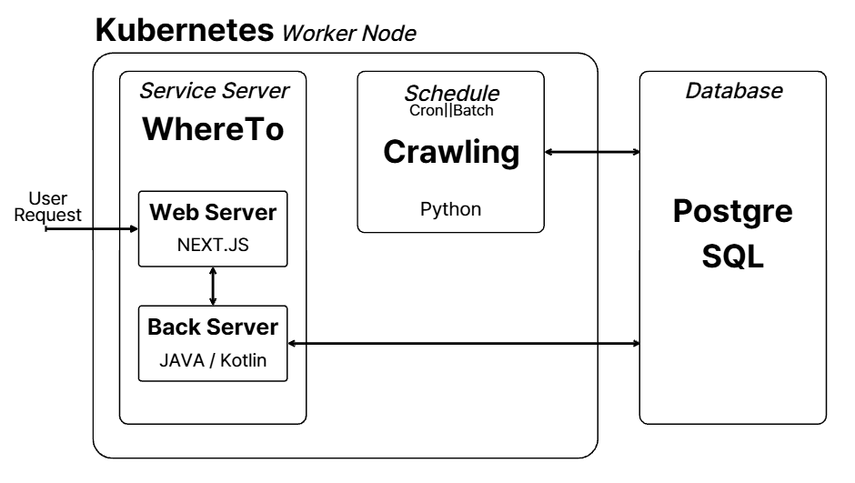

# 🐍Crawling | Python Toy Project
## 📌Purpose
This project crawls Naver blog posts, calculates an interest score based on the number of blog posts, and stores the processed data in a PostgreSQL database.

## 🎄To-be Architecture

## 🛠 Tech Stack
- ***Python***
- ***Scrapy***
- ***FastAPI***
- ***PostgreSQL***
- ***SQLAlchemy***

### Required Libraries to run
>pip install scrapy uvicorn psycopg2-binary playwright beautifulsoup4

### Uvicorn run command
>python -m uvicorn source.src.api.main:app 